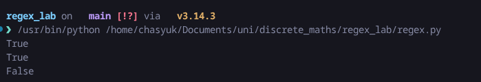

# Regex FSM

Реалізація рушія регулярних виразів на основі скінченного автомата (FSM) мовою Python.

## Імплементація

Програма будує **недетермінований скінченний автомат (НСА)** з рядка регулярного виразу та перевіряє, чи відповідає вхідний рядок заданому патерну.

### Підтримувані оператори

| Оператор | Опис |
|----------|------|
| `.` | Будь-який символ |
| `*` | Нуль або більше повторень попереднього символу |
| `+` | Одне або більше повторень попереднього символу |
| `a-z`, `0-9` тощо | Літеральні ASCII-символи |

### Архітектура класів

Кожен оператор регулярного виразу представлений окремим класом-станом, що наслідує абстрактний `State`:

| Клас | Роль | `check_self()` |
|------|------|-----------------|
| `StartState` | Початковий стан автомата | — |
| `TerminationState` | Кінцевий (приймаючий) стан | Завжди `False` |
| `AsciiState` | Літеральний символ | `True` якщо символ збігається |
| `DotState` | Wildcard `.` | Завжди `True` |
| `StarState` | Квантифікатор `*` (0+) | Делегує перевірку вкладеному стану |
| `PlusState` | Квантифікатор `+` (1+) | Делегує перевірку вкладеному стану |

Кожен стан зберігає список `next_states` — перехідних станів, що формують орієнтований граф автомата.

### Побудова автомата (`RegexFSM.__init__`)

Конструктор послідовно читає символи регулярного виразу й для кожного створює відповідний стан:

1. **Літерал або `.`** — створюється `AsciiState` / `DotState`, попередній стан отримує перехід до нового.
2. **`*` (StarState)** — обгортає попередній стан. Створює циклічний зв'язок: `StarState → inner_state → StarState`, що дозволяє повторення 0+ разів. Перехід від `grand_prev` перенаправляється зі старого стану на `StarState`, щоб забезпечити можливість пропуску (0 повторень).
3. **`+` (PlusState)** — аналогічно `*`, але без перенаправлення переходу від `grand_prev`, тому щонайменше одне входження обов'язкове.
4. По завершенні до останнього стану додається `TerminationState`.

Приклад для патерну `a*4`:

```
StartState ──→ StarState ⇄ AsciiState('a') ──→ AsciiState('4') ──→ TerminationState
     └──────────────────────────────────────────↗
```

### Перевірка рядка (`check_string`)

Метод реалізує **симуляцію НСА** шляхом паралельного відстеження всіх можливих станів:

1. Починає з множини `{StartState}`.
2. Для кожного символу вхідного рядка обходить усі поточні стани та збирає множину наступних станів, до яких можна перейти.
3. Для `StarState`/`PlusState` додатково перевіряються внутрішні стани (під-переходи квантифікатора).
4. Якщо на будь-якому кроці множина станів порожня — рядок відхиляється.
5. Після обробки всіх символів перевіряється, чи хоча б один з поточних станів має перехід до `TerminationState`.

## Запуск

### Вимоги

- Python 3.10+

### Інструкція

```bash
python regex.py
```

Або імпортувати як модуль:

```python
from regex import RegexFSM

fsm = RegexFSM("a*4.+hi")
print(fsm.check_string("aaaaaa4uhi"))  # True
```

## Приклади

Патерн: `a*4.+hi`

```
$ python regex.py

True    ← "aaaaaa4uhi"  (a повторюється 6 разів, 4, будь-який символ 1+ раз, hi)
True    ← "4uhi"        (a — 0 разів, 4, u, hi)
False   ← "meow"        (не відповідає патерну)
```

## Скріншоти


